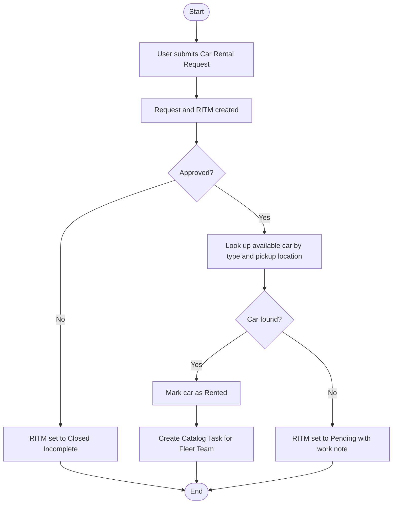

# Car Rental Request Automation in ServiceNow

## Project Overview

This project automates the car rental request process in ServiceNow using a **Service Catalog** item and **Flow Designer**.

An employee submits a Car Rental Request from the Service Catalog. The request goes for approval, the system looks for a matching available car in a custom **Car Inventory** table, and a fulfillment task is created for the **Fleet Team**. If no car matches, the request is put on hold with a work note.

## Technologies Used

- ServiceNow (Personal Developer Instance)
- Service Catalog
- Flow Designer
- Business Rules (JavaScript)
- Catalog Client Scripts (JavaScript)
- Custom table, roles and access controls
- Catalog Tasks
- Update Sets

## Requirements

- ServiceNow Developer Instance (PDI)
- System Administrator role
- Access to Service Catalog and Flow Designer
- Basic knowledge of ServiceNow and JavaScript

## Service Catalog Item

**Item name:** Car Rental Request  
**Category:** Transport  
**Description:** Request a car for official travel

| Variable | Type | Mandatory |
|----------|------|-----------|
| Requestor | Reference (User) | Yes |
| Requested Date | Date | Yes |
| Car Type | Lookup Select Box (from Car Inventory) | Yes |
| Pickup Location | Single Line Text | Yes |
| Drop Location | Single Line Text | Yes |
| Duration | Numeric Scale | Yes |
| Reason for Rental | Multi Line Text | No |

## Car Inventory Table

A custom table (`u_car_inventory`) stores the cars available for rent. It has its own application menu (**Car Inventory**), a module (**Car Inventories**), and a role (`u_car_inventory_user`).

| Field | Type | Details |
|-------|------|---------|
| Car Number | String | Registration or fleet number |
| Car Type | Choice | Hatchback, Sedan, SUV, Luxury |
| Location | String | Where the car is based |
| Availability | Choice | Available, Maintenance, Rented |
| Assigned Request | Reference | Requested Item (`sc_req_item`) |

## Workflow

The flow **Car Rental Fulfillment** runs when a Car Rental Request is submitted:

1. The request is created as a Requested Item (RITM).
2. The flow sends the request for **approval**.
3. **If rejected**, the RITM is set to *Closed Incomplete*.
4. **If approved**, the flow looks up a car in Car Inventory that matches the requested **car type** and **pickup location** and is marked **Available**.
5. **If a car is found**, the car is marked **Rented** and a **Catalog Task** ("Assign car for rental request") is created for the **Fleet Team**.
6. **If no car is found**, no car is assigned and the RITM is set to *Pending* with the work note "No matching car available at this time."



## Main Components

### 1. Business Rules

| Business Rule | Table | When | What it does |
|---------------|-------|------|--------------|
| Copy Car Rental Variables to RITM | Requested Item | Before insert/update | Copies the catalog variables (car type, locations, duration, date, reason) into fields on the RITM so the flow can use them |
| Prevent Assignment of Unavailable Car | Requested Item | After update | Makes sure no car is assigned when none is available, and raises an Incident ("Car unavailable for request: RITM number") so the Fleet Team can follow up |

### 2. Catalog Client Scripts

| Script | Field | Validation |
|--------|-------|------------|
| Validate pickup location | Pickup Location | Letters and spaces only |
| Validate Drop location | Drop Location | Letters and spaces only |
| Validate Future Requested dates | Requested Date | Must be a future date |

If a value is invalid, the field is cleared and an error message is shown.

### 3. Flow Designer

Handles approval, car lookup, updating car availability, and creating the fulfillment task (see the Workflow section).

## Testing

| Test Case | Expected Result |
|-----------|-----------------|
| Approved request, matching car exists | Car is marked Rented and a task is created for the Fleet Team |
| Manager rejects the request | RITM is set to Closed Incomplete |
| Approved request, no matching car | No car is assigned and the RITM is set to Pending with a work note |
| Pickup or Drop Location contains numbers or symbols | Error message is shown and the field is cleared |
| Requested Date is today or in the past | Error message is shown and the field is cleared |
| Mandatory field left empty | Request cannot be submitted |

## Project Objective

Reduce manual effort by automating the car rental request process, with one place to submit, approve, fulfill and track requests.

## Deployment

The whole configuration is packaged as an **Update Set** (`Car Rental Request Automation`) and can be moved to another ServiceNow instance.

1. In the target instance, go to **System Update Sets > Retrieved Update Sets**.
2. Click **Import Update Set from XML** and upload the XML file from this repository.
3. Open the imported update set and click **Preview Update Set**.
4. Fix any problems the preview reports, then click **Commit Update Set**.

After importing, check these two things in the target instance:

- The **approver** set in the flow's approval step exists, or change it to a valid user.
- A group named **Fleet Team** exists, since the catalog task is assigned to it.

## Repository Structure

```
1.Ideation Phase
2.Requirement analysis
3.project desgin phase
4.Project Planning Phase
5.Project development phase
6 Project Documentation
7.Project Demonstration
```
